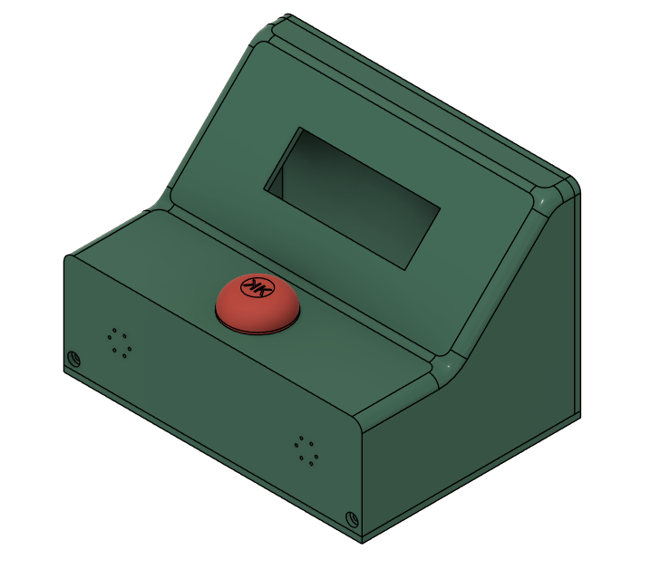
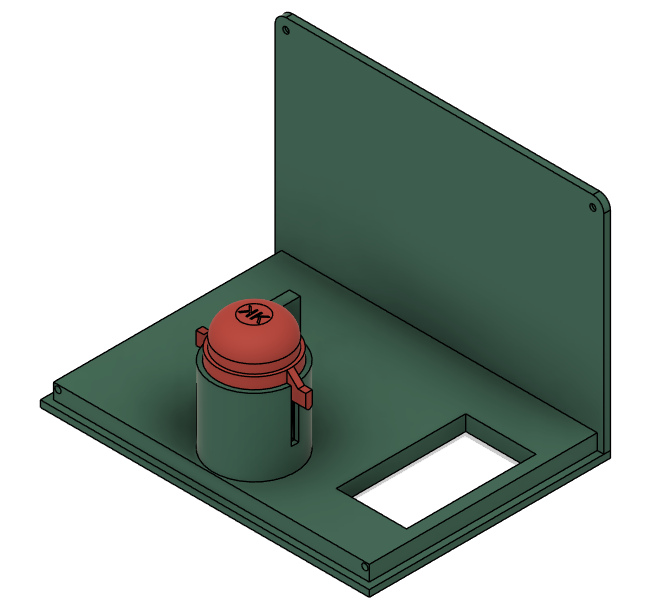

# Kleine Karer Vaffel Klokke

## Introduction
The KKVK is a fun, custom-made clock developed for a friend. It integrates both humor and functionality to keep track of time and number of waffles made. The clock features a countdown timer, waffle count, and customizable melodies to make the waffle-making experience more enjoyable.

# Usage

## Button Press Durations
The clock recognizes four levels of button press durations to navigate through menus and settings:

- **Short Press**: Less than 1 second
- **Long Press**: Between 1 second and 3 seconds
- **Very Long Press**: Between 3 seconds and 5 seconds
- **Insanly Long Press**: More than 5 seconds

## Menu-Specific Functions

### Main Menu
- **Short Press**: Starts the timer.
- **Long Press**: Opens the melody adjustment menu.
- **Very Long Press**: Opens the timer adjustment menu.
- **Insanly Long Press**: Opens the waffle count adjustment menu.

### Timer Running
- **Short Press**: No function (timer must run out or be stopped via a longer press).
- **Long Press**: Stops the timer and returns to the main menu.
- **Very Long Press**: Stops the timer and returns to the main menu.
- **Insanly Long Press**: Stops the timer and returns to the main menu.

### Adjusting Timer
- **Short Press**: Increments the timer's current setting (minutes or seconds, depending on the cursor position).
- **Long Press**: Moves the cursor to the next setting (cycles from minutes to seconds).
- **Very Long Press**: Saves the adjusted timer settings to EEPROM and returns to the main menu.
- **Insanly Long Press**: Cancels the adjustment and returns to the main menu without saving changes.

### Adjusting Melody
- **Short Press**: Cycles through the available melodies.
- **Long Press**: Plays the currently selected melody.
- **Very Long Press**: Saves the selected melody to EEPROM and returns to the main menu.
- **Insanly Long Press**: Cancels the adjustment and reverts to the previously saved melody, then returns to the main menu.

### Adjusting Waffles
- **Short Press**: Increments the waffle count based on the current increment setting (e.g., +1, +5).
- **Long Press**: Cycles through different waffle count increments.
- **Very Long Press**: Saves the new waffle count to EEPROM and returns to the main menu.
- **Insanly Long Press**: Cancels any changes and reverts to the previous waffle count, then returns to the main menu.

## Melodies

The KKVK includes several melodies that can be selected and played. The melodies are stored in the `melodies.h` file and can be customized or expanded as needed. The current melodies include:

- **Melody 0**: Button press sound (Not available for selection)
- **Melody 1**: Zelda Secret Sound
- **Melody 2**: Norwegian National Anthem
- **Melody 3**: Nokia Tune
- **Melody 4**: O jul med din glede (Norwegian Christmas song)
- **Melody 5**: Mario Start Sound
- **Melody 6**: Glory Glory (football chant)

# Technical Setup

## Components
- Arduino Nano
- LiquidCrystal LCD for display
- Buttons for input
- EEPROM for storing settings like melody choice and timer duration
- Buzzer for audio output
- Diode for reverse current protection
- 9V Battery holder for power

## EEPROM Memory Layout
- **Address 0**: Timer duration (in seconds)
- **Address 2**: Melody index
- **Address 4**: Number of waffles made

## Code Structure
The code includes several custom functions to handle button presses, display updates, and EEPROM data management. Melodies and large number displays are handled by included libraries (`melodies.h` and `LCDBigNumbers.hpp`).

# Installation
To set up your KKVK, upload the provided Arduino sketch to your board, connect the hardware components as per the circuit diagram (not included, buildt based on pinouts), and power the device. Ensure the EEPROM has initial values set for the timer duration and melody to operate correctly from the first boot.

# Contributions
Feel free to fork this project, submit issues, and propose pull requests via GitHub. This project is open for enhancement from the Arduino and maker community.
